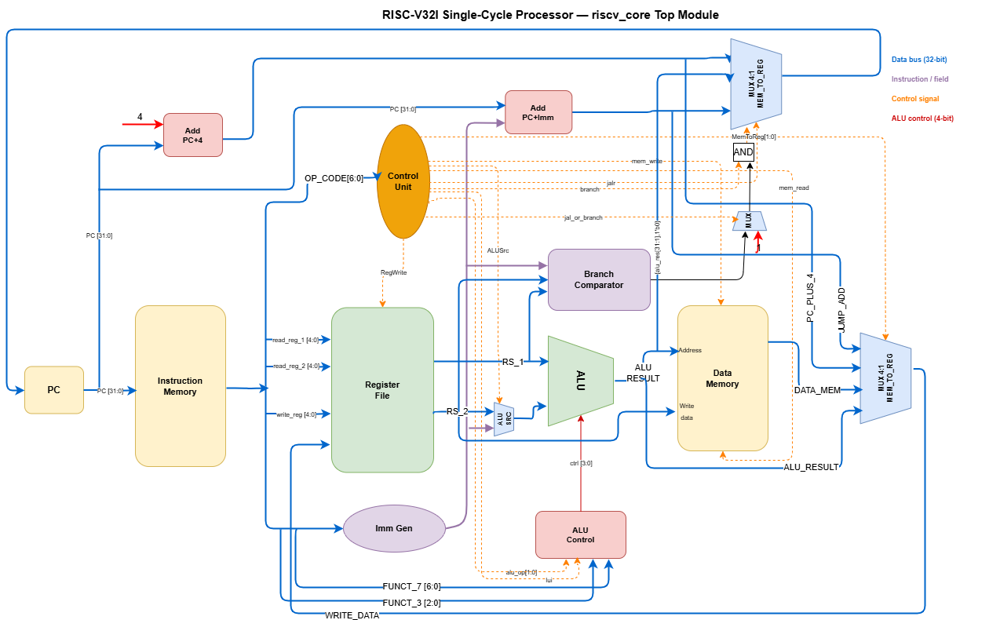

# RV32I Single-Cycle Processor

A fully functional 32-bit RISC-V (RV32I) single-cycle processor implemented in Verilog. The design covers the complete datapath and control path, verified through 11 unit-level testbenches and a 15-test-case integration testbench.

---

## Architecture



The core is single-cycle — every instruction completes fetch, decode, execute, memory, and writeback in one clock period.

**Sub-modules:** `fetch_unit` · `instruction_memory` · `register_file` · `control_unit` · `imm_gen` · `alu_control` · `alu_unit` · `branch_comparator` · `data_memory`

---

## Instruction Support

| Category | Instructions |
|----------|-------------|
| R-Type | ADD, SUB, AND, OR, XOR, SLL, SRL, SRA, SLT, SLTU |
| I-Type | ADDI, ANDI, ORI, XORI, SLLI, SRLI, SRAI, SLTI, SLTIU |
| Memory | LW, SW |
| Branch | BEQ, BNE, BLT, BGE, BLTU, BGEU |
| Jump | JAL, JALR |
| Upper Imm | LUI, AUIPC |

> Byte/halfword memory access (LB, LH, SB, SH…) is intentionally out of scope.

---

## Directory Structure

```
RISC-V32I/
├── rtl/                  # RTL source files
├── dv/                   # Testbenches
├── test_programs/        # .hex programs for integration tests
├── docs/                 # Module specs and DV plans
├── compile_all.do        # ModelSim compile + run script
└── riscv_datapath.drawio # Datapath diagram
```

---

## Simulation

Requires ModelSim (or any Verilog-2005 compatible simulator).

```bash
vsim -do compile_all.do
```

Expected output:
```
==============================================
  Testbench completed with 0 errors
==============================================
```

---

## Verification

**11 unit testbenches** — one per sub-module, each with a spec and DV plan in `docs/`.

**15 integration test cases** in `Riscv_Core_tb.v`:

| TC | Name |
|----|------|
| 01 | Sequential Data Dependency |
| 02 | Store → Load (SW / LW) |
| 03 | Branch Not Taken (BEQ) |
| 04 | Loop — Backward Branch (BNE) |
| 05 | Function Call (JAL + JALR) |
| 06 | Upper Immediate (LUI, AUIPC) |
| 07 | ALU Overflow & Negative Arithmetic |
| 08 | SLT vs SLTU (Signed vs Unsigned) |
| 09 | Shift Edge Cases (SLL, SRA, SRL) |
| 10 | BEQ Taken — Forward Jump |
| 11 | BLT & BGE (Signed Branches) |
| 12 | BLTU & BGEU (Unsigned Branches) |
| 13 | JALR LSB Clearing |
| 14 | LUI + ADDI 32-bit Constant |
| 15 | SW / LW with Non-Zero Base & Negative Offset |
